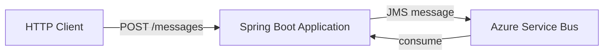

# Azure Service Bus Producer

Small reference project demonstrating asynchronous messaging between a Spring Boot application and **Azure Service Bus** using JMS.

The project focuses on a simple enterprise integration scenario: exposing an HTTP endpoint that publishes a message to Azure Service Bus and receiving messages through the same Spring-based messaging stack.

## Architecture



## Technology stack

- Java 17
- Spring Boot 3
- Spring Web
- Spring JMS
- Spring Cloud Azure
- Azure Service Bus
- Maven

## What this project demonstrates

- Integration of Spring Boot with Azure Service Bus
- JMS-based asynchronous messaging
- Externalized Service Bus configuration
- Simple REST-to-messaging integration flow
- Basic producer/consumer interaction in a cloud messaging scenario

## Configuration

Azure Service Bus settings are defined in:

`src/main/resources/application.yml`

```yaml
spring:
  jms:
    servicebus:
      connection-string:
      topic-client-id:
      pricing-tier:
```

Populate these values with the settings of your Azure Service Bus environment before starting the application.

> Do not commit credentials or production connection strings to the repository.

## Run

### Prerequisites

- JDK 17
- Maven
- An Azure Service Bus namespace
- Valid Service Bus connection settings

Start the application:

```bash
mvn clean spring-boot:run
```

Then send a message:

```bash
curl -X POST "http://localhost:8080/messages?message=hello"
```

A successful flow should produce application logs similar to:

```text
Sending message
Received message: hello
```

## Notes

This repository is intentionally small and focuses on the integration pattern rather than production hardening.

A production implementation would typically add concerns such as:

- managed identity or secret-store integration
- retry and dead-letter handling
- structured message contracts
- correlation and tracing
- metrics and alerting
- automated tests
- environment-specific configuration

## References

- Microsoft documentation: Use JMS in Spring to access Azure Service Bus
- Microsoft documentation: Spring Cloud Stream with Azure Service Bus
